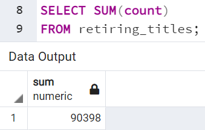
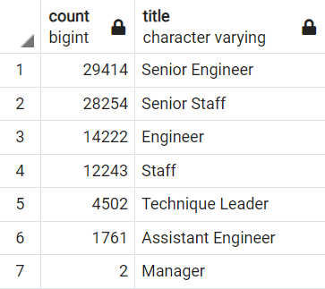
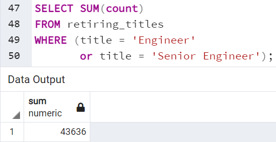

# Pewlett Hackard Analysis
## Project Overview
Pewlett Hackard is a leading information technology company that provides hardware and software solutions to many customers, ranging from casual consumers to worldwide enterprises. They have maintained a robust outlook in a continuously evolving industry where innovation and disruptive technology can make or break a company. Pewlett Hackard attributes its unwavering success to its diligent staff consisting of thousands of scientists, engineers, and business professionals. Unfortunately, their tenured staff cannot work forever, so PH must be mindful of the roles that will become vacant in the upcoming years. 
In this project, we will explore various CSV files containing employee information and link them together in a database management system to uncover the positions that will need to be filled, along with determining which employees are eligible for retirement packages. By taking a proactive approach to its staffing needs, PH can further bulletproof the company in an industry full of uncertainty. 
## Resources
- pgAdmin 4.30
- PostgreSQL 11.11
## Results
- 90,398 employees are expected to retire in the upcoming years based on the retiring titles table we created

     
    
- At first glance, it appears the vast majority of retiring staff are either senior staff or senior engineers

     
    
  - 33% of retiring employees are senior engineers
  - 31% of retiring employees are senior staff
- If we consider senior engineers and engineers as an entire unit, then the amount of retiring engineers is closer to 50% 

     

- There are 1549 eligible employees for the mentorship-eligibility program based on the mentorship-eligible table we created

     

## Summary
### Part 1:
 PH must act quickly and decisively, especially in the engineering department, considering almost half of their retiring employees are all engineers. The engineers and senior staff are imperative to navigating the company's course. Considering there are over 90,000 positions that will vacate and only 1,549 employees that meet our initial mentorship-eligibility criteria, we must adjust our queries to get specific amounts in specific timeframes. Only then will PH adequately forecast when and how many positions need to be filled in a particular year. The eldest employees born in 1952 will most likely be the first wave of the tsunami, so by creating a query that includes the amount of retiring employees born in that year, we can determine the immediate positions needed to be filled. The following SQL query creates a new table with current employees, their current position, and 1952 as their birth year:

Using the count function to count all the rows in the new table just created, we determined that there are 16,981 employees on the verge of retirement. We can further group them by their titles as we did before:

The table indicates we still need to focus our efforts on the engineering and senior staff department, but the amount of retirees is more manageable to address than before. Assuming employees born in the same year retire the same year, we can now apply the method described above to the retiring employees born after 1952 on a year per year basis to gauge how many roles will need to be filled each year. 

### Part 2:
There are not enough employees eligible for the mentorship program that can accommodate the influx of employees expected to replace the retiring staff. The current eligibility criteria does not take into account how long the employees have been employed at PH. We can modify the mentorship criteria to include the most tenured staff who presumably have the most valuable insights. Perhaps we can even provide incentives for younger tenured employees so they can also participate. We can refactor the initial criteria query to include all employees who are either senior staff or senior engineers since those are the positions that need the most attention:

By refactoring the original criteria query to include all current employees who are senior staff or senior engineers, we have 167,973 possible candidates who can potentially participate in the mentorship program. Even if we narrow the criteria to only those born between 1953-1973, we still have more than enough candidates to accommodate the mentorship program! 
